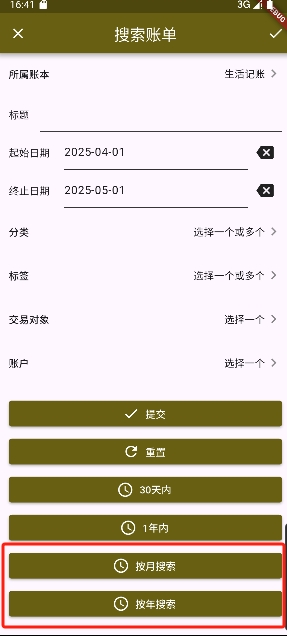
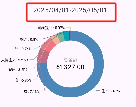

# 九快记账App

## 新增Feature

- 搜索账单添加按月搜索与按年搜索，取消本月、今年和去年选项。

  

- 图标处显示时间。

  
## 原项目介绍
本项目是九快记账App端源代码，使用Flutter开发，支持安卓和iOS端。

[安卓APK下载地址](https://github.com/getmoneynote/moneynote-flutter/releases)

登录界面后台地址为运行API的地址。示例：http://www.xxx.com， http://ip:43743

